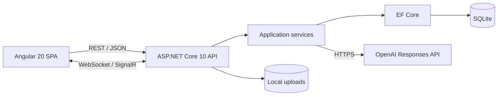
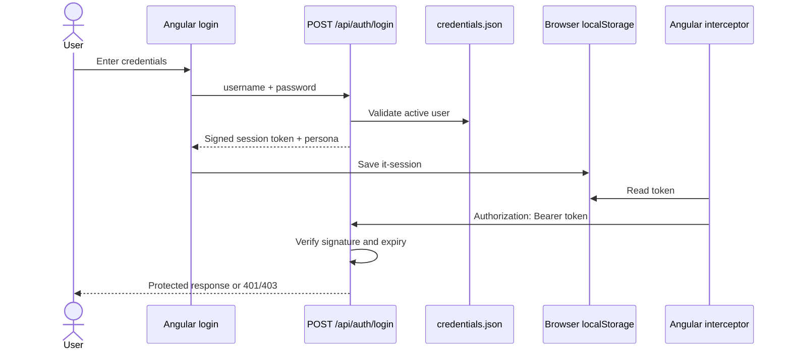
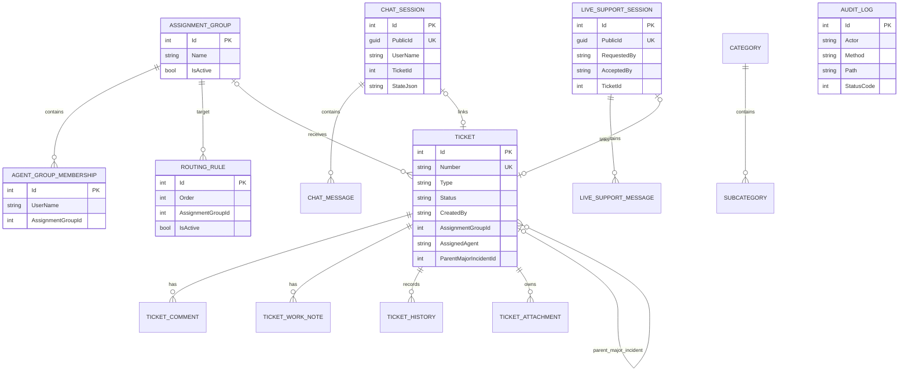
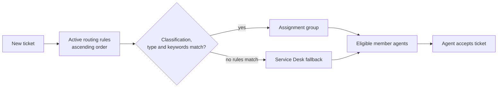
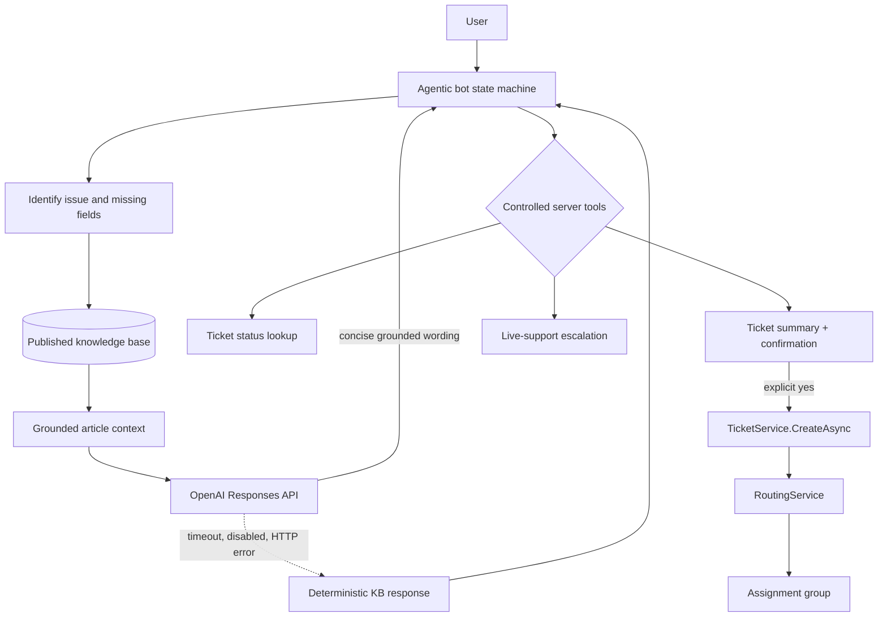
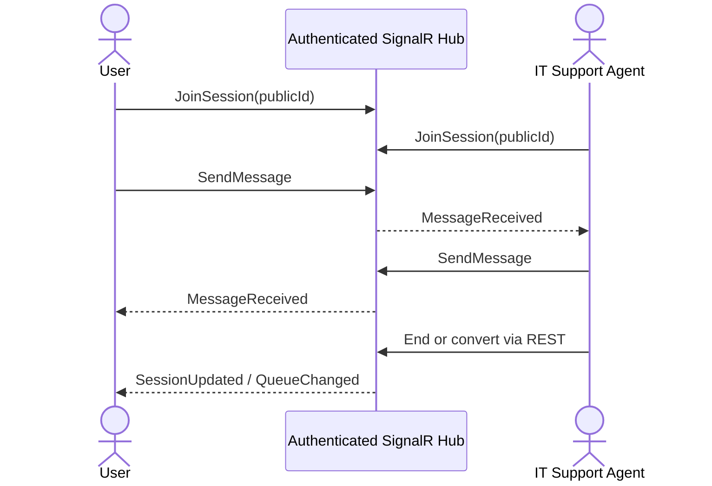
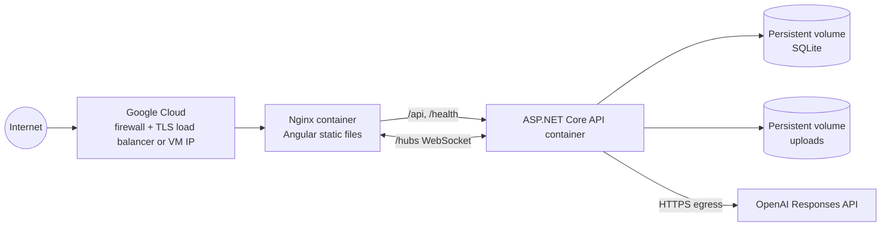

# Oritso IT Support CRM — Technical Architecture

## 1. Product overview

Oritso IT Support CRM is a demo-oriented IT service management system for banking Cheque Truncation System (CTS) support. It combines ticket intake and lifecycle management, assignment-group routing, major-incident linking, an approved knowledge base, a conversational assistant, and real-time human support.

The repository deliberately keeps the implementation compact: an Angular 20 single-page application, one ASP.NET Core 10 minimal API, EF Core with one SQLite database, local attachment storage, and editable file-based demo credentials. Internal project names and routes remain stable to avoid a risky rename; Oritso is the user-facing product identity.



## 2. Repository and runtime structure

| Layer | Implementation | Responsibility |
|---|---|---|
| Web client | `frontend`, Angular 20 standalone components | Login, dashboards, ticket forms/queues/details, Admin console, chatbot widget, live-support console |
| HTTP/realtime edge | `Program.cs`, `LiveSupportHub.cs` | REST routes, token validation, RBAC, error handling, audit middleware, SignalR |
| Application | `Application/Services.cs` | Credentials, signed sessions, access rules, ticket creation, routing, chatbot orchestration, OpenAI calls |
| Domain | `Domain/Entities.cs` | Persistent ticket, catalog, KB, chat, live-support, and audit models |
| Persistence | `Infrastructure/AppDbContext.cs` | EF Core model, indexes, relationships, SQLite access |
| Bootstrap | `SeedData.cs`, `credentials.json`, `.env` | Demo data, personas, runtime configuration |
| Deployment | Dockerfiles, Compose, Nginx | API container, SPA container, reverse proxy, volumes |

The Angular root component currently owns the page-level portal state. `it-chat-widget` and `it-live-support` are standalone components. `ApiService` centralizes HTTP calls and resolves its API URL from runtime `config.js`, enabling the widget and portal to use the same API contract in another host application.

## 3. Authentication, session tokens, and RBAC

Users are loaded from `backend/ItSupport.Api/credentials.json`. This is an intentional demo substitute for ASP.NET Identity. Password comparison is fixed-time, but passwords are stored as plaintext. A successful login returns a custom HMAC-SHA256 signed token containing username, display name, role, and expiry. It is not a JWT despite having similar claims.



The API authentication middleware protects `/api` and `/hubs`; only `/`, `/health`, `/api/auth/*`, and development OpenAPI routes are public. The SignalR client passes the same token as `access_token` during its WebSocket negotiation. The Admin route group has a server-side role filter. Therefore changing or hiding Angular controls cannot grant Admin access.

| Persona | Effective authorization |
|---|---|
| User | Own tickets, own live sessions, chatbot/KB/catalog; cannot use Admin deletion APIs |
| ITSupport | Tickets routed to a member assignment group or assigned directly; all live queues; internal work notes; cannot use Admin deletion APIs |
| Admin | All tickets and live sessions, configuration/users/memberships, operational deletion |

The Angular interceptor clears an expired/invalid session on HTTP 401. A 403 is retained and displayed as an authorization error where handled.

## 4. Data model

SQLite is configured through EF Core. Startup creates and seeds the database when needed. Unique indexes protect ticket numbers, chatbot public IDs, live-session public IDs, and duplicate agent/group membership.



`TicketId`, `AssignmentGroupId`, and `ParentMajorIncidentId` links that do not have configured EF navigation relationships are logical references in this demo. Before ticket deletion, chatbot/live links and child major-incident links are explicitly cleared. Database cascades remove ticket comments, work notes, history, and attachment metadata; chatbot and live-session deletion cascades their messages. A deletion-specific `AuditLog` tombstone is inserted before the source data is removed.

Attachment bytes are stored under the API `uploads` directory with generated file names. Download authorization is checked through the parent ticket. On ticket deletion, each physical file is removed only after the database transaction succeeds and only when no remaining attachment metadata references its stored name. Canonical path validation prevents deletion outside the uploads directory.

## 5. Tickets, major incidents, and routing

Ticket types include standard incidents and major incidents. A ticket stores classification, affected service, impact, urgency, priority, current status, assignment group, optional assigned agent, resolution, escalation, and optional parent major-incident ID. Every created ticket receives an `INC000001`-style number after its database identity is allocated.

Typical lifecycle:

1. User or a controlled chatbot/live-support workflow submits the issue.
2. `TicketService` calls `RoutingService` before persistence.
3. The first active routing rule by ascending `Order` whose populated fields and keyword condition match wins.
4. If no rule matches, Service Desk (or the first active group) is selected.
5. Creation and routing history rows are recorded.
6. Authorized support staff can accept, reassign, change status/priority, add internal work notes, link to a major incident, escalate, and resolve.
7. Users can add public comments and attachments and track status/history; internal work notes are omitted from their response view.



Assignment-group membership is configured by an Admin for `ITSupport` accounts. Ticket list and detail authorization is based on creator, direct agent assignment, membership, or Admin role.

## 6. Knowledge base and agentic chatbot

Published knowledge articles contain category, subcategory, keywords, and approved content. Portal search uses a database query; chatbot retrieval first filters on category/subcategory, then ranks up to three candidates by exact subcategory and keyword overlap.

The bot is agentic in a bounded application sense. `ChatService` maintains a durable JSON state machine (`Identify`, `Troubleshooting`, `Collecting`, `Confirm`, `Created`, and live/resolved states) and invokes controlled application tools:

- classify supported CTS/CBS intents;
- retrieve approved KB articles;
- look up the user's latest ticket;
- gather error, impact, urgency, start time, and attempted troubleshooting;
- create a ticket only after explicit user confirmation;
- call the same `TicketService` and routing engine as the portal;
- create a live-support session and notify the queue.



### OpenAI Responses API and function execution boundary

When enabled, the server posts `model`, `instructions`, and grounded `input` to the configured Responses API URL. The prompt requires use of supplied approved articles only. The API key never reaches Angular. Timeouts, missing keys, non-success responses, malformed/empty output, and transport failures return the deterministic approved-KB fallback.

The current implementation does **not** expose OpenAI function-calling tools or let model output mutate CRM data. Tool execution is application-controlled by the state machine. Ticket creation requires a `confirm-ticket` action or recognized affirmative confirmation, and the backend—not the LLM—builds and routes the ticket. This is the intentional safety boundary for the demo.

## 7. Bot intake to ticket creation

```mermaid
sequenceDiagram
    actor User
    participant Widget as Reusable Angular widget
    participant Chat as POST /api/chat
    participant KB as Knowledge DB
    participant AI as OpenAI Responses API
    participant Tickets as TicketService
    participant Routing as RoutingService
    User->>Widget: Describe issue
    Widget->>Chat: message + optional sessionId
    Chat->>KB: Retrieve approved matches
    Chat->>AI: Issue + approved knowledge
    AI-->>Chat: Grounded troubleshooting wording
    Chat-->>Widget: Steps + follow-up question
    loop Required intake fields
      User->>Chat: error / impact / urgency / timing / attempts
    end
    Chat-->>Widget: Summary; ask for confirmation
    User->>Chat: Yes, create the ticket
    Chat->>Tickets: CreateAsync(..., source=Agentic IT Assistant)
    Tickets->>Routing: Match ordered rules
    Routing-->>Tickets: Assignment group
    Tickets-->>Chat: Ticket number
    Chat-->>Widget: Created and routed confirmation
```

Each conversation and message is persisted. The returned session public ID lets the widget continue the same stateful conversation. The standalone selector is `it-chat-widget`; integration into another Angular host requires the component plus an `ApiService` configured for the Oritso API. Non-Angular hosts can build their own UI over `POST /api/chat`. Cross-origin hosts must be explicitly configured in `FrontendUrl`; the server does not allow arbitrary origins.

## 8. SignalR live support and chat escalation



Users can open only sessions they requested; ITSupport and Admin can access the queue. The hub validates both identity and conversation authorization on join and send, limits messages to 2,000 characters, persists before broadcast, and blocks ended sessions. REST endpoints manage queue creation, acceptance, ending, and ticket conversion. A chatbot escalation creates a waiting session and broadcasts `QueueChanged`. An Admin deletion broadcasts `SessionDeleted`; connected clients clear the deleted conversation.

Chat-to-ticket conversion embeds the persisted transcript in the ticket description and sends the result through the normal creation/routing/history path.

## 9. Administrative deletion

The Admin console danger zone loads a deletion inventory and offers separately confirmed deletion for tickets, chatbot sessions, and live-support sessions. The UI explains the dependent records to be removed and reports success/failure. Backend authorization is the source of truth: `/api/admin/*` checks the `Admin` role and returns 403 to User and ITSupport tokens.

Deletion behavior:

| Root deleted | Cascaded/updated data | Retained evidence |
|---|---|---|
| Ticket/major incident | comments, work notes, history, attachment metadata; chat/live ticket links and child major links set null; unreferenced files removed | `AuditLog` deletion tombstone and request audit |
| Chat session | all `ChatMessage` rows | `AuditLog` deletion tombstone and request audit |
| Live session | all `LiveSupportMessage` rows; active clients notified | `AuditLog` deletion tombstone and request audit |

Audit tombstones intentionally contain identifiers and counts, not transcript or ticket body content.

## 10. REST and realtime API summary

All paths below except login are authenticated.

| Method/path | Purpose | Authorization |
|---|---|---|
| `POST /api/auth/login` | Validate file credentials and issue signed session | Public |
| `GET /api/me`, `GET /api/catalog` | Current persona and active catalog | Any authenticated |
| `GET/POST /api/tickets` | Authorized queue; create routed ticket | Authenticated, list filtered by persona |
| `GET /api/tickets/{id}` | Detail, comments, permitted notes/history/attachments | Ticket access policy |
| `PATCH /api/tickets/{id}` | Assignment/status/priority/major link/escalation/resolution | ITSupport/Admin with ticket access |
| `POST .../accept`, `/comments`, `/work-notes`, `/attachments` | Ticket collaboration | Per-route and ticket access rules |
| `GET /api/attachments/{id}` | Authorized attachment download | Parent ticket access |
| `GET /api/knowledge?q=` | Published KB list/search | Any authenticated |
| `POST /api/chat` | Stateful bot conversation and actions | Any authenticated |
| `GET/POST /api/live-support` | Persona-filtered queue/create request | Any authenticated |
| `GET/POST /api/live-support/{publicId}/*` | Transcript, messages, accept/end, ticket link/creation | Owner or staff as route requires |
| `GET /api/admin/configuration`, `/users`, `/bot-status` | Admin console data | Admin only |
| `POST/PUT/DELETE /api/admin/*` configuration routes | Users, memberships, catalogs, rules, articles | Admin only |
| `GET /api/admin/deletion-inventory` | Operational deletion targets | Admin only |
| `DELETE /api/admin/tickets/{id}` | Cascading ticket deletion and file cleanup | Admin only |
| `DELETE /api/admin/chat-sessions/{id}` | Cascading AI conversation deletion | Admin only |
| `DELETE /api/admin/live-sessions/{id}` | Cascading transcript deletion | Admin only |
| `/hubs/support` | `JoinSession`, `SendMessage`; message/session/queue events | Authenticated and session-authorized |

## 11. Configuration

`.env.example` is the authoritative template. `EnvLoader` reads the repository `.env` for local API runs and converts double underscores to .NET configuration separators. Docker Compose injects the same file as environment variables.

| Variable | Use |
|---|---|
| `AUTH__SIGNINGKEY`, `AUTH__SESSIONHOURS` | HMAC session signing and lifetime |
| `OPENAI_API_KEY`, `OPENAI_ENABLED`, `OPENAI_MODEL`, `OPENAI_BASE_URL` | Optional Responses API integration |
| `FRONTENDURL` | Exact CORS origin |
| `CONNECTIONSTRINGS__DEFAULT` | SQLite data source |
| `UPLOADS__MAXFILESIZEBYTES`, `UPLOADS__PATH` | Intended upload policy settings; current upload route enforces its own 10 MB check and local `uploads` path |
| `LIVECHAT__*`, `CHATBOT__*` | Documented feature policy settings; the current demo code does not dynamically disable all routes from these flags |

Never commit `.env`. Change every seeded credential and the signing key before exposing a server. The repository deliberately includes `.env.example` with no OpenAI secret.

## 12. Docker and Google Cloud deployment

Docker Compose builds the API and Angular/Nginx containers. Nginx serves the SPA, falls back to `index.html` for client navigation, proxies `/api` and `/health`, and preserves WebSocket upgrade headers for `/hubs`. Named volumes persist SQLite and uploads; `credentials.json` is bind-mounted.



For the architecture as implemented, the least surprising Google Cloud demo deployment is one Compute Engine Linux VM:

1. Install Docker Engine and the Compose plugin.
2. Copy the repository, create `.env`, replace credentials/signing key, and set `FRONTENDURL` to the public HTTPS origin.
3. Attach persistent disk capacity for Docker volumes and establish backups for database and uploads.
4. Run `docker compose up -d --build`.
5. Put Google Cloud HTTPS Load Balancing, or a TLS-configured host proxy, in front of port 8080 and allow WebSocket upgrades.
6. Restrict SSH, firewall ingress, and file permissions; configure monitoring and an external uptime check on `/health`.

Cloud Run is not a safe lift-and-shift target for this exact persistence design: its local filesystem is ephemeral and independently scaled instances cannot safely share SQLite or local uploads. A single-instance Cloud Run demo would still require external persistent storage and careful concurrency constraints.

## 13. Security, logging, validation, and errors

- Data annotations and explicit route checks bound required fields and message/content lengths.
- Ticket, attachment, live session, and hub authorization is enforced server-side.
- Admin deletion is role-checked at the API group, independent of Angular.
- Uploaded names are discarded for storage; download names are sanitized with `Path.GetFileName`; canonical path checks guard filesystem operations.
- Exceptions are logged server-side and returned as a generic HTTP 500 payload.
- Every `/api` request writes actor, method, path, status, and timestamp to `AuditLog`; sensitive request/response bodies are not copied.
- OpenAI diagnostics log enablement, model, success, and fallback conditions without returning or logging the API key.
- CORS is credential-aware and restricted to one configured frontend origin.

This demo does not yet include rate limiting, CSRF strategy beyond bearer headers, malware scanning, MIME/content inspection, secret-manager integration, account lockout, refresh/revocation, encryption at rest, structured distributed tracing, or a retention/redaction policy. Those are production requirements.

## 14. Demo constraints and recommended production architecture

The current architecture is appropriate for a controlled demonstration and a single application instance. Primary scale limits are SQLite's write concurrency, in-process routing/chat orchestration, local files, file credentials, one allowed CORS origin, in-process SignalR fan-out, startup seeding instead of versioned migrations, and a single large root Angular portal component.

For production:

- replace credentials/custom tokens with OIDC/OAuth 2.0 through Microsoft Entra ID, Google Identity, or another enterprise IdP, with short-lived JWTs and explicit policies;
- move SQLite to PostgreSQL/Cloud SQL and use EF Core migrations, transactions, backups, replicas, and connection resiliency;
- move attachments to Cloud Storage using signed access, malware scanning, checksums, retention, and lifecycle rules;
- use Google Secret Manager and workload identity for secrets;
- scale SignalR with a managed backplane/service or Redis and use sticky-session guidance where applicable;
- place jobs and integrations behind Pub/Sub or a queue with idempotency and retries;
- split application services behind interfaces, add automated unit/integration/end-to-end tests, and separate Angular feature routes/components;
- add centralized structured logs, traces, metrics, alerting, WAF/rate limiting, audit export, and privacy/retention controls;
- if enabling model function calling later, expose a strict allowlist of JSON-schema tools, authorize each tool server-side, require confirmation for mutations, validate all arguments, and record tool decisions/results.

These changes preserve the existing REST/widget concepts while removing the single-node assumptions of the demo.
